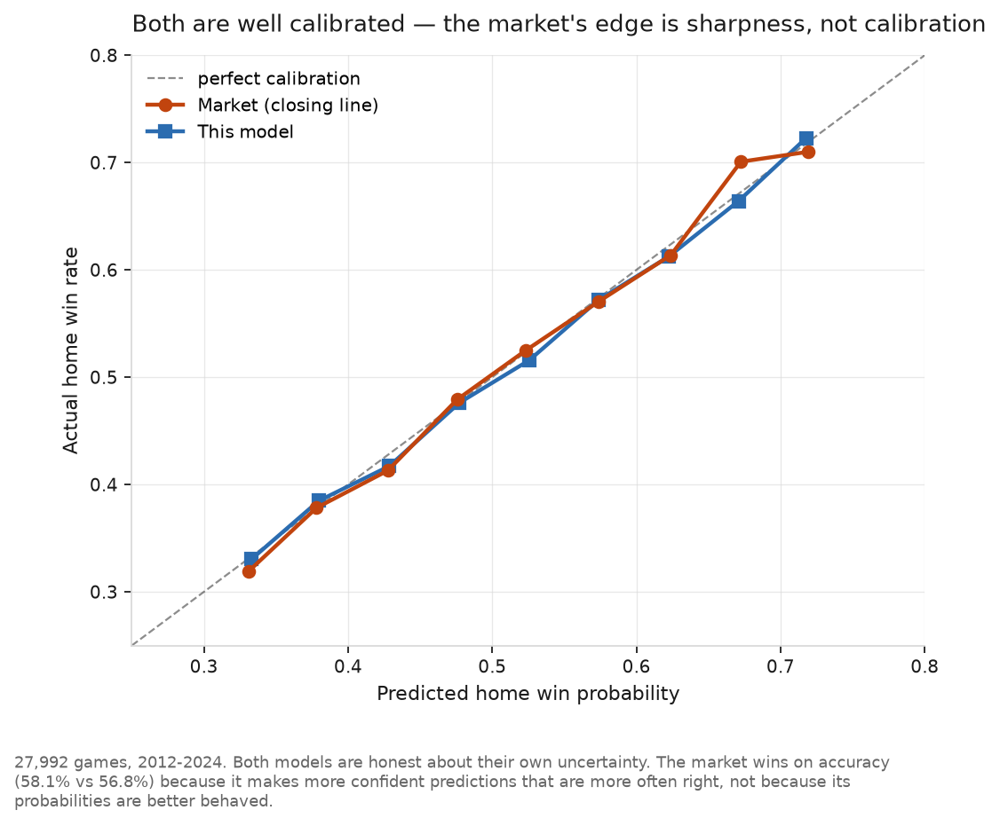
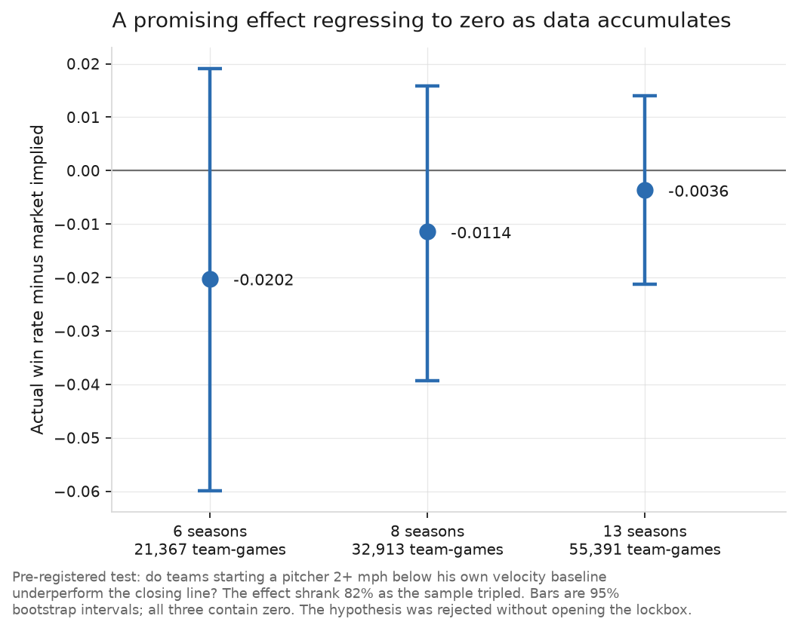

# MLB Game Forecasting

**Can a well-built forecasting model beat an existing market-priced benchmark?
Here, no — and establishing that rigorously is the result.**

|  |  |
|---|---|
| **Question** | Can a model trained on public baseball data outperform the betting market's closing price at forecasting game outcomes? |
| **Data** | 34,015 games (2010-2024), 10.0M pitches, and 32,523 closing moneylines from two independent odds sources |
| **Method** | Point-in-time features with no lookahead, walk-forward evaluation, metrics screened for reliability before use, hypotheses pre-registered with a held-out season |
| **Result** | The model beats a naive baseline decisively (log loss 0.679 vs 0.691) and loses to the market (0.673). Four separate attempts to find an exploitable gap all failed. |
| **Takeaway** | A model can be correct, well-validated, and still not worth deploying. Knowing that *before* acting on it — and knowing precisely why — is the deliverable. |

The generalizable version: when an incumbent benchmark already exists, the
useful question is not "is my model good?" but "is it better than what is
already there, and if not, what specifically does the incumbent know?" This
project answers both.

## How to reproduce

    conda create -n mlb python=3.12 -y
    conda activate mlb
    pip install pybaseball pandas pyarrow scikit-learn matplotlib openpyxl

Fetch data (Windows syntax; bash equivalents in `data/README.md`):

    for %y in (2010 2011 2012 2013 2014 2015 2016 2017 2018 2019 2021 2022 2023 2024) do python src\fetch_gamelogs.py %y
    for %y in (2010 2011 2012 2013 2014 2015 2016 2017 2018 2019 2021 2022 2023 2024) do python src\fetch_statcast.py %y

Odds workbooks must be downloaded by hand — both sources block automated access.
`data/README.md` lists exactly which files and where they go. Then:

    python src/build_spine.py            # one row per game, unique IDs
    python src/build_features.py         # point-in-time team and Elo features
    python src/build_odds.py             # parse Excel archive (2010-2019)
    python src/build_odds_json.py        # parse JSON dataset (2021-2024)
    python src/compare_odds_sources.py   # cross-source validation
    python src/join_odds.py              # union, validate against scores
    python src/build_pitcher_starts.py   # 10M pitches -> 68K starts
    python src/stabilization.py          # reliability screen
    python src/build_pitcher_features.py
    python src/evaluate_market.py        # headline result
    python src/compare_models.py         # logistic vs GBM vs stacking
    python src/find_edges.py             # pre-registered subsets
    python src/velocity_edge.py          # pre-registered hypothesis
    python src/park_edge.py              # pre-registered hypothesis
    python src/make_charts.py            # figures in reports/

No data files are committed. Everything except the odds workbooks rebuilds from
scratch.

## Headline result

Evaluated on 27,992 games (2012-2024), predicting the home team's win
probability:

| Model | Log loss | Brier | Accuracy |
|---|---|---|---|
| Base rate (league home win %) | 0.69098 | 0.24892 | 53.3% |
| Elo | 0.68036 | 0.24367 | 56.5% |
| Team-level features (runs-allowed proxy) | 0.67995 | 0.24347 | 56.4% |
| Statcast pitcher features | 0.67869 | 0.24286 | 56.8% |
| **Market (closing moneyline)** | **0.67318** | **0.24020** | **58.1%** |
| Statcast features + market price | 0.67346 | 0.24033 | 58.0% |

Adding every engineered feature *on top of* the market price makes the
prediction slightly worse. The features carry real signal, but it is already
inside the closing line.

The calibration curve above shows something more precise than "the market is
better." Both are equally well calibrated — when either says 55%, that happens
about 55% of the time. The market's advantage is **sharpness**: it makes more
confident predictions that are more often right.

## Four independent attempts to find an edge

The interesting part is not the headline number. It is that the same conclusion
was reached four ways, each ruling out a different explanation for the gap.

| Attempt | Premise | Result |
|---|---|---|
| **Better features** | The market measures something we don't | Statcast pitcher metrics closed a quarter of the gap, then stopped |
| **A reliable signal it ignores** | Velocity decline is observable but not headline news | Effect shrank 82% as data tripled; rejected |
| **A mechanism nobody prices** | Bullpen depletion is invisible and unposted | 98% redundant with team strength; rejected |
| **A better model class** | The relationships are nonlinear | Gradient boosting was *worse*; stacking was a tie |
| **A second-moment effect** | Park changes variance, not team strength | Market prices it fully; rejected |

### A hypothesis that died correctly

**Mechanism, stated before testing:** velocity is publicly observable but not a
headline number, and books price primarily off results. A starter throwing 2+
mph below his own baseline shows a physical signal of fatigue or injury before
it reaches his ERA. Velocity delta is the most reliable measurement available
(split-half r = 0.978), so a 2 mph deviation is signal, not noise.

The effect shrank by 82% as the sample tripled. A real effect holds its
magnitude and tightens its interval; this one decayed toward zero.

The early result was directionally correct, monotonic across thresholds, and
entirely spurious. **Stopping at six seasons would have produced a "finding."**

### Bullpen workload: a mechanism that was really a proxy

**Mechanism:** a bullpen that threw heavily over the prior two or three days has
fewer rested arms. Books price starters explicitly; relief availability is
posted nowhere.

| Check | Result | Reading |
|---|---|---|
| Does depletion persist to the next game? | r = -0.019 to +0.022 | No |
| Does it predict a longer leash on the starter? | r = **-0.055** | Wrong sign |
| Raw association with winning | r = +0.027 | Looks promising |
| **Residual after removing Elo and run differential** | **r = +0.0005** | **Entirely redundant** |

The raw +0.027 would have looked like a modest real signal to anyone who
checked only that. But bullpen workload correlates **+0.22 with team run
differential** — bad teams burn their bullpens. It is a team-quality proxy
wearing a fatigue label, and 98% of its apparent signal vanishes once team
strength is removed.

### Park factors: the market prices the variance effect

**Mechanism:** park does not favor the home team — both sides bat in it. What a
hitter's park changes is *variance*. Higher run environments widen the
distribution of run differential, compressing win probability toward .500. If
the market under-adjusts, its probabilities are too extreme in high-run parks.

Tested as an interaction, walk-forward:

    logit(P(home win)) = a + b·market_logit + c·market_logit·park_centered

The mechanism predicts c < 0. Result: **c = -0.0025, 95% CI (-1.01, +0.78)** —
null. Coors Field alone, the most extreme park in baseball, shows favorites at
-0.008 against implied over 590 games.

Park factors were computed point-in-time on an expanding window with shrinkage,
and validated by independently recovering baseball geography: the five lowest
are Oracle, T-Mobile, Petco, Tropicana and Citi Field; the highest is Coors at
1.24.

**The market fully prices a second-moment effect** — it is not merely getting
team strength right, it correctly handles how run environment reshapes the
outcome distribution.

### Model class is not the constraint

Three families under identical walk-forward evaluation, with stacking using
**nested splits** so the meta-learner only ever sees out-of-fold base
predictions:

| Model | Log loss | Brier | Accuracy |
|---|---|---|---|
| Logistic regression | **0.67854** | 0.24278 | 56.8% |
| Gradient boosting | 0.68002 | 0.24350 | 56.8% |
| Stacked | 0.67820 | 0.24262 | 57.0% |
| Market | 0.67305 | 0.24013 | 58.1% |

Gradient boosting is *worse*, in 9 of 11 seasons. Stacking is the decisive
evidence: a meta-learner given both models had every chance to weight the GBM
where it helped and effectively reproduced the logistic model instead.

## Which metrics are worth using, and why

Before building any pitcher feature, each candidate was tested for split-half
reliability at the 8-start window the model uses:

| Metric | r at k=8 | Verdict |
|---|---|---|
| Release velocity | **0.978** | Physical measurement; near-perfect |
| Strikeout rate | **0.645** | Stabilized |
| Walk rate | 0.427 | Nearly stabilized |
| xwOBA on contact | 0.392 | Marginal |
| Run expectancy per batter faced | 0.230 | Mostly noise |
| Home run rate | 0.160 | Noise |

**Descriptive accuracy and predictive value run opposite here.** Run expectancy
per batter faced is the best description of what a pitcher did — sorting all
68,020 starts by it returns Verlander's 2019 no-hitter, then German's 2023
perfect game, then Braden's, Halladay's, Cain's and Hernandez's perfect games.
Every perfect game of the era, found by a metric never told what one is.

It is also the least reliable metric in the table, because it embeds
batted-ball outcomes driven by defense, park and luck. It was excluded, along
with home run rate — whose 0.160 independently replicates the known result that
pitchers exert little control over home runs per fly ball.

## The subset analysis

Overall efficiency does not rule out local inefficiency, but subset search is
where honest projects become dishonest ones. Two safeguards: every subset was
specified in code with a stated mechanism before results were examined, and the
2024 season was sealed. **The lockbox was never opened, because it was never
needed.**

Exploration set 2012-2023, 25,752 games. Positive gain means the model beat the
market:

| Subset | Mechanism | n | Gain | 95% CI |
|---|---|---|---|---|
| All games | reference | 25,752 | -0.0055 | (-0.0067, -0.0043) |
| First 15 games of season | little current-season info | 4,935 | -0.0042 | (-0.0069, -0.0012) |
| Unproven starter | no track record to price | 3,566 | -0.0088 | (-0.0125, -0.0049) |
| Doubleheader game 2 | bullpen depletion unpriced | 209 | -0.0109 | (-0.0289, +0.0070) |
| Short-rest starter | non-standard rotation slot | 231 | -0.0027 | (-0.0210, +0.0166) |
| Widest vig quintile | thin, low-confidence market | 5,151 | -0.0042 | (-0.0070, -0.0015) |
| Largest disagreement decile | where our info differs most | 2,576 | -0.0245 | (-0.0328, -0.0161) |

**The disagreement decile is the central finding.** The analysis was run three
times — with weak features, after the Statcast upgrade, and on the full dataset.
Every subset improved with better features except this one, which got *worse*
(-0.0182 to -0.0198). Where the model diverges most from the closing line, a
better model performs worse. If the features held information the market
lacked, this is exactly where it would surface.

**Why the deciles are left in the output:** the velocity analysis also reports
deciles. In the six-season run, decile 4 — a trivial -0.09 to -0.26 mph range
with no plausible mechanism — showed a bias of -0.019, the same magnitude as
the pre-registered primary test. On the full dataset it is +0.0016. That is what
noise looks like, and had the analysis gone fishing across deciles instead of
committing to a threshold in advance, it would have been reported as a finding.

## Three bugs caught by independent validation

Every join is checked against a source produced independently. None of these
would have been visible from inspecting a single source.

**Doubleheaders swapped.** The odds join matched 99.86% of games but agreed on
final score for only 98.75%. The failures were doubleheaders with game 1 and
game 2 reversed — the odds file orders by betting rotation number, which does
not follow Retrosheet's scheduled sequence. Emitting both orderings and keeping
whichever the independent score confirms raised agreement to 99.83%.

**Spring training contamination.** The Statcast pull returned 2,554 games for a
2,429-game season and 1,067 pitchers where only 831 appeared in the regular
season. Those stats would have corrupted every rolling pitcher average.

**A median of American odds is meaningless.** American odds are discontinuous —
no valid line exists strictly between -100 and +100. Four books at
[-110, -104, +100, +105] give a "median" of -2, which is not a price. This
surfaced only because two odds sources overlap in 2021: their correlation was
0.628 where it should have been near 1. Computing consensus in probability space
raised it to **0.9975**, with 98.6% of games agreeing within 2 probability
points.

## How leakage is prevented

1. **Single chronological pass.** Features are emitted from accumulator state,
   and only then is the game's result folded in. A game cannot inform its own
   prediction.
2. **Walk-forward evaluation.** Models train only on seasons strictly before the
   one they predict. No random split anywhere. Stacking uses nested splits.
3. **No post-game columns.** Team rank, games back and streak all contain the
   outcome of the row they sit on. None are used.
4. **Matched numerator/denominator pairs.** A start missing a metric contributes
   to neither side of its ratio. An earlier version counted a missing xwOBA as
   zero while still counting its batters, silently recording every pre-2015
   start as a perfect performance.
5. **No monotonic counters.** Career start counts rise with the calendar, making
   them a date proxy a model will exploit.

## Data

**Game logs:** [Retrosheet](https://www.retrosheet.org/gamelogs/), 2010-2024 —
34,015 games, both starting pitchers, zero duplicate IDs.

**Statcast / PITCHf/x:** 9.99M pitches via pybaseball, regular season only,
aggregated to 68,020 starts. Velocity and run expectancy from 2010; xwOBA and
launch data require Statcast cameras and begin in 2015.

**Odds:** two independent sources. 2010-2019 from the SportsBookReview Excel
archive (one aggregated line); 2021-2024 from a JSON dataset (median across ~6
books, each de-vigged individually in probability space, with games dropped
where books disagreed by more than 10 probability points).

32,523 of 34,015 games matched (95.6%), 99.83% score agreement.

**2020 is excluded** — the 60-game season had a universal DH, seven-inning
doubleheaders, and a runner on second in extras.

## Other findings

- **Home-field advantage has declined sharply**, .5593 in 2010 to .5216 in 2024.
- **Bookmaker hold rose with the retail era** — 2.79% on 2010-2019 aggregated
  lines, 4.22% across 2021-2024 retail books.
- **Short-rest games are hard for everyone.** Market log loss is 0.698 there
  against 0.673 overall; its own accuracy degrades on non-standard rotation
  slots, though not enough to create an edge.
- **Days of rest correlates negatively with winning** (r = -0.016), opposite the
  intuitive direction — rest is confounded with the reasons it occurs.
- **One pre-registered mechanism was falsified.** Wide vig was predicted to
  signal thin markets; those games are in fact easier to predict, because wide
  vig tracks lopsided matchups.

## Known limitations

- **The JSON odds sample is not random.** Games dropped for book disagreement
  are systematically those books found hardest to price — plausibly where
  mispricing lives.
- **Innings pitched is approximated** from batters faced and last inning, since
  Statcast does not expose outs recorded per pitcher.
- **Velocity baselines drift with age**, since the baseline is a career average
  dominated by peak years.
- **2010 and 2011 match at only 93%** against the odds archive. Not diagnosed.
- **No weather, lineup, or injury data.**

## Next steps

The four failed attempts point one direction: the remaining gap will not close
through better modeling of public box-score data. What the market has and this
model does not is almost certainly announced lineups, late scratches, weather at
first pitch, and money from informed participants — none available in free
historical form.

Stated plainly: **the productive next step is better data, not a better model.**

## Repo layout

| File | Purpose |
|---|---|
| `src/fetch_gamelogs.py` | Download Retrosheet game logs |
| `src/build_spine.py` | Combine seasons, build unique game IDs |
| `src/build_features.py` | Point-in-time team and Elo features |
| `src/inspect_odds.py` | Inspect an odds workbook before parsing |
| `src/build_odds.py` | Parse Excel archive, map teams, de-vig |
| `src/inspect_odds_json.py` | Inspect the JSON odds dataset |
| `src/build_odds_json.py` | Parse JSON odds in probability space |
| `src/compare_odds_sources.py` | Cross-source price validation |
| `src/join_odds.py` | Union sources; validate against scores |
| `src/fetch_statcast.py` | Pull pitch data, cached and resumable |
| `src/build_pitcher_starts.py` | Aggregate pitches into per-start lines |
| `src/stabilization.py` | Split-half reliability by sample size |
| `src/build_pitcher_features.py` | Point-in-time pitcher features |
| `src/build_bullpen.py` | Bullpen workload by calendar day |
| `src/bullpen_screen.py` | Persistence and redundancy screen (rejected) |
| `src/build_park.py` | Point-in-time park factors with shrinkage |
| `src/park_edge.py` | Variance-compression hypothesis test |
| `src/metrics.py` | Log loss, Brier, accuracy, calibration |
| `src/baseline_elo.py` | Walk-forward Elo baseline |
| `src/train_model.py` | Walk-forward logistic regression |
| `src/evaluate_market.py` | Model and baselines vs. the closing line |
| `src/evaluate_pitcher.py` | Statcast features vs. the old proxy |
| `src/compare_models.py` | Logistic vs. GBM vs. nested stacking |
| `src/find_edges.py` | Pre-registered subset analysis |
| `src/velocity_edge.py` | Pre-registered velocity-decline test |
| `src/make_charts.py` | Figures |

## Attribution

The information used here was obtained free of charge from and is copyrighted by
Retrosheet. Interested parties may contact Retrosheet at 20 Sunset Rd., Newark,
DE 19711.

Statcast data is provided by MLB Advanced Media via Baseball Savant, accessed
through [pybaseball](https://github.com/jldbc/pybaseball).